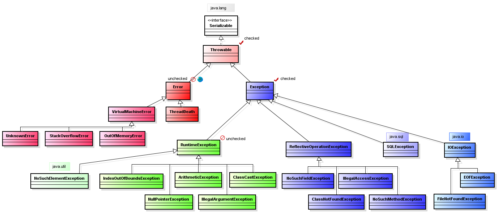

# Вопросы для собеседования на Java Developer

+ [Общие](#Общие) ![icon][done]
+ [JVM](#jvm) ![icon][done]

[done]:done.png

# Общие
### 1
__ООП__ — подход, при котором программа рассматривается как набор объектов, взаимодействующих друг с другом.
>+ Проще масштабировать программы и внедрять изменения
>+ Код структурирован, в нем проще разобраться

__Класс__ - шаблон объекта, определяющий структуру и поведение. __объект__ представляет экземпляр этого класса.

__Инкапсуляция__ – это свойство системы, позволяющее объединить данные и методы, работающие с ними, в классе и скрыть детали реализации от пользователя, открыв только то, что необходимо при последующем использовании.

Цель инкапсуляции — уйти от зависимости внешнего интерфейса класса от реализации. Чтобы малейшее изменение в классе не влекло за собой изменение внешнего поведения класса.

+	Модификаторы доступа (Access modifiers)  
	`public, default (package),  protected, private`
+	Геттеры и Сеттеры (Getters and Setters)  

__Наследование__ – это свойство системы, позволяющее описать новый класс на основе уже существующего с частично или полностью заимствующейся функциональностью.  
`extends, super, instanceof`

__Полиморфизм__ – это возможность работать с несколькими типами так, будто это один и тот же тип. При этом поведение объектов будет разным в зависимости от того, к какому типу они принадлежат.  
`extends, implements, переопределение`

### 2
`Object` это базовый класс для всех остальных объектов в Java. Любой класс наследуется от `Object` и, соответственно, наследуют его методы:

+ `clone()` – создает и возвращает копию объекта;
  >Если не имплементится cloneable, то будет падать CloneNotSupportedException
+ `equals(Object obj)` – служит для сравнения объектов по значению;
+ `hashCode()` – возвращает hash код для объекта;
+ `finalize()` – может вызываться сборщиком мусора в момент удаления объекта при сборке мусора.
  >Нельзя точно сказать, когда вызовется, и вообще вызовется ли
+ `getClass()` – возвращает класс объекта во время выполнения;
  >Class.forName()  
  >Рефлексия позволяет получить информацию о типе(класс, интерфейс) внутреннем строении класса (поля, методы) и позволяет обратиться к ним даже в рантайме.
+ `toString()` – возвращает строковое представление объекта;
+ `notify()` – возобновляет поток, ожидающий монитор;
  >Этот и последующие методы вызываются только из синхронизированного блока
+ `notifyAll()` – возобновляет все потоки, ожидающие монитор;
+ `wait()` – остановка вызвавшего метод потока до момента пока другой поток не вызовет метод `notify()` или `notifyAll()` для этого объекта
+ `wait(long timeout)` 
+ `wait(long timeout, int nanos)` – остановка вызвавшего метод потока на определённое время или пока другой поток не вызовет метод `notify()` или `notifyAll()` для этого объекта;

### 3
+ Рефлексивность: `a.equals(a)`
+ Симметричность: `a.equals(b) && b.equals(a)`
+ Транзитивность: `a.equals(b) && b.equals(c) && a.equals(c)`
+ Консистентность: `a.equals(b)` всегда
+ Not-null: `x.equals(null) == false`

### 4
По-умолчанию equals сравнивает ссылки на объекты.  
Для одинаковых объектов хеш-коды всегда будут равны.   
Если хеш-коды разные, то и входные объекты гарантированно разные.  
Если хеш-коды равны, то входные объекты не всегда равны (коллизия).

### 5
Метод equals() необходим для определения, являются ли два объекта логически равными. То есть эквивалентны ли их значимые поля

### 6
__Сериализация__ - процесс записи состояния объекта в поток, процесс извлечения или восстановления состояния объекта из потока - __десериализация__. Сериализация очень удобна, когда идет работа со сложными объектами.
> Необходимо имплементить Serializable, иначе упадет NotSerializableException  
> Externalizable - расширенная сериализация, с большим контролем над процессом

### 7
Заставить нельзя, но можно предложить
+ Runtime.getRuntime().gc()
+ System.gc()

### 8
Стек работает по схеме LIFO. Всякий раз, когда вызывается новый метод, на вершине стека под них выделяется блок памяти. Стек хранит значения примитивных переменных, создаваемых в методах, а также ссылки на объекты в куче на которые ссылается метод.
>Работает быстрее кучи. Потокобезопасный, для каждого потока свой стек

Куча используется для динамического выделения памяти для объектов и классов JRE во время выполнения. Новые объекты всегда создаются в куче, а ссылки на них хранятся в стеке.
Эти объекты имеют глобальный доступ и могут быть получены из любого места программы.
>Автоматически не очищается, используется сборщик мусора

Для обнаружения мусора существует два подхода:
+ Reference counting – счетчик ссылок
+ Tracing – до «живого» объекта можно добраться из корневых точек (основной Java поток, локальные переменные и параметры в основном методе, статические переменные основного класса)
>Куча делится на Young Generation(Eden, FromSpace, ToSpace), Old Generation, Permanent Generation
>Новые объекты помещаются в Эдем. Если объект пережил сборку мусора, он помещается в более старшее поколение

Типы сборщиков мусора:
+  Serial GC (последовательный) - однониточный коллектор. В основном относится к небольшим приложениям 
+  Parallel GC (параллельный) - использует несколько потоков для выполнения процесса сбора мусора, выполнение приложения все равно останавливается

Mostly concurrent GC (В основном параллельный, работает одновременно с приложением):
+ Concurrent Mark Sweep (Параллельное сканирование отметок) 
+ Shenandoah - c Java12
+ Garbage First (+++) - области не делятся на поколения

### 9
+ StrongReference - сборщик мусора уничтожает такие объекты только тогда, когда на них больше не остается сильных ссылок.
+ SoftReference - такие объекты будут удалены, если JVM требуется память
  >SoftReference<Cat'> catRef = new SoftReference<Cat'>(cat);
+ WeakReference - объект будет уничтожен при ближайшей сборке мусора
+ PhantomReference - используется вместе с ReferenceQueue. Добавится в очередь после того, как выполнится метод finalize()

### 10
Immutable класс после инициализации не может изменить свое состояние
> + final класс
> + без сеттеров
> + коллекции внутри неизменяемые (immutable или отдавать копию, создавать копию при создании)

### 11

### List 
Упорядоченный список объектов. Элементы списка могут вставляться или извлекаться по их индексу.
#### ArrayList
Оптимизирован для произвольного доступа к элементам, но с относительно медленными операциями вставки/удаления элементов в середине списка.  
__Добавление__: ensureCapacity(size+1) - увеличение размера листа. Вызывается и при добавлении нового элемента. Если места недостаточно, размер увеличивается в 1,5 раза.  
При добавлении в середину часть элементов смещается копированием.
>Поиск элемента по индексу - О(1), по значению - O(n)  

__Удаление__: размер массива не уменьшается автоматически

#### LinkedList
Оптимизирован для последовательного доступа, с быстрыми операциями вставки/удаления. Произвольный доступ выполняется относительно медленно, т.к. требует полного перебора элементов

LinkedList состоит из нодов, которые включают сам объект и ссылки на следующий и предыдущие объекты в списке. 
При добавлении элемента создается новый Node, а ссылки у пердыдущего и последующего элемента переопределяются.
>Получение первого и последнего элемента, добавление в начало или конец - О(1), добавление в середину - O(n)

>ConcurrentModificationException - падает при прохождении итератором по коллекции и одновременной попытке модифицировать её

### Map
В контейнерах Map хранятся два объекта: ключ и связанное с ним значение. Ключи должны быть уникальными, а значения могут дублироваться.
#### HashMap
Использует хэш-таблицу, что позволяет операциям get() и put() выполнятся за константное время даже для больших наборов. Порядок хранения элементов не гарантируется. Непотокобезопасна.
Bucket (корзина) -это единственный элемент массива HashMap. Он используется для хранения узлов (Nodes)
>capacity - емкость бакета  
capacity = number of buckets * load factor  
threshold — Предельное количество элементов, при достижении которого, размер хэш-таблицы увеличивается вдвое.   
> threshold = capacity * loadFactor

При добавлении элемента сначала рассчитывается индекс бакета. Если корзина занята, то идет проверка на равенство ключей с помощью hashcode и equals. Если ключи одинаковые, то значение заменяется. Если нет - создается связанный список
>index = hashCode(key) & (length-1)

Сложность получения элемента - __О(1)__. Из связанного списка - __О(n)__.

В Java 8 после достижения определенного порога вместо связанных списков используются сбалансированные деревья, что улучшает производительность до __O(log n)__
#### HashTable
Синхронизирована
#### LinkedHashMap
Упорядоченная реализация хэш-таблицы. Порядок итерирования равен порядку добавления элементов из-за двунаправленной связи между элементами (аналогично LinkedList)
#### TreeMap
Использует структуру красно-чёрного дерева и хранит ключи отсортированными по возрастанию. Переопределить сортировку можно предоставив экземпляр класса Comparator, метод compare которого и будет использован для сортировки ключей. При этом ключи должны реализовывать интерфейс Comparable.
TreeMap подходит для задачи последовательного обхода элементов.
>Добавление и получение элементов - __O(log n)__

>Поиск начинается из корня дерева. Сравнением значения с узлами ищется маршрут
>+ Корень должен быть окрашен в черный цвет.
>+ Листья дерева должны быть черного цвета.
>+ Красный узел должен иметь два черных дочерних узла.
>+ Черный узел может иметь любые дочерние узлы.
>+ Путь от узла к его листьям должен содержать одинаковое количество черных узлов.
>+ Новые узлы добавляются на места листьев.  
> Поэтому путь через черные узлы всегда короче, чем через красные

### Set
Каждый элемент хранится только в одном экземпляре.  
HashSet, LinkedHashSet, TreeSet - особенности реализаций аналогичны Map.

### Concurrent
Стандартные многопоточные коллекции: Stack, Vector, HashTable. Все методы этих классов - synchronized  
Статические методы в классе Collections. Применяется декоратор, который оборачивает каждый метод в synchronized-блок.
+ synchronizedCollection()
+ synchronizedList()
+ synchronizedMap()
+ synchronizedSet()  

Пакет java.util.concurrent:
+ CopyOnWriteArrayList, ArrayList - все операции по изменению коллекции (add, set, remove) приводят к созданию новой копии внутреннего массива
+ ConcurrentHashMap
+ ConcurrentLinkedQueue
+ BlockingQueue

### 12

Компилятор не проверяет факт обработки __непроверяемых__ исключений.  
__Проверяемые__ - обрабатываются с помощью конструкции try..catch, либо можно передать обработку через throws.
__Errors__ - связаны с проблемами уровня JVM

### 13
Дженерики — это параметризованные типы.
Тип данных, которыми они оперируют, указан в виде параметра. Можно создать единственный класс, который будет автоматически работать с разными типами данных.
> public class TwoGen<T, V> {}

Дженерики позволяют компилятору выполнять дополнительные проверки типов, но в рантайме вся информация о классах-параметрах теряется.
Затирание типов компилятором:
+ List< Integer> - List
+ List< Integer>[] - List[]
+ <T extends Comparable<T>> - Comparable
+ <T extends Object & Comparable<? super T>> - Object

Wildcards:
+ '<? extends T> - T и его наследники (не позволяет добавлять элементы в список кроме null)
+ '<? super T> - T и его родители (не позволяет получать элементы из списка кроме Object)
+ '<?> - <? extends Object>

> PECS — Producer Extends Consumer Super

### 14
__Процесс__ состоит из кода и данных. Он создается операционной системой при запуске приложения, является достаточно ресурсоемким и обладает собственным виртуальным адресным пространством.
Процессы работают независимо друг от друга. Они не имеют прямого доступа к общим данным в других процессах.  
__Поток__ — наименьшее составляющее процесса. Потоки могут выполняться параллельно друг с другом.

__Способы запуска__:
1. implements Runnable  
   override run()  
   (new Thread(new Runnable())).start()
2. extends Thread  
   override run()  
   (new Thread()).start()

__Завершение потоков__:  
Вместо stop() применяется схема, в которой каждый поток сам ответственен за своё завершение.
1. Опрос логической переменной
   >private volatile boolean isRunning = true;  
   >while(isRunning()) {}
2. interrupt()
   >thread.interrupt();  
   >while (!Thread.interrupted()) {}

Если во время выполнения методов sleep(), wait() и join() будет вызван метод interrupt() этого потока, они, не дожидаясь конца времени ожидания, сгенерируют исключение __InterruptedException__.
Если бесконечный цикл полностью не обернут в try-catch, то при перехватывании ошибки следует обновлять значение флага
>try {  
  ...  
} catch ( InterruptedException e ) {  
Thread.currentThread().interrupt();  
}  

__Мьютекс__ — специальный объект для синхронизации потоков, прикрепленный к каждому объекту в Java. Имеет 2 состояния: свободен, занят.  
__Монитор__ — это дополнительная «надстройка» над мьютексом. Содержит список потоков, которые не смогли захватить блокировку и список ожидающих потоков.

Блоки синхронизации применяются для исключения состояния гонки
>synchronized(obj){}

__join()__ - приостановит выполнение текущего потока до тех пор, пока другой поток не закончит свое выполнение.
>myThread.join() - главный поток будет ждать завершения потока myThread

__wait()__ - используется для общего использования ресурсов разными потоками. __notify()__ сигнализирует об освобождении ресурса.    
Служит для синхронизации выполняющихся одновременно потоков

__yield()__ - означает, что поток не выполняет ничего особо важного, и если другие потоки или процессы требуют запуска, то их можно запустить

__Executor__ - средство для эффективного управления несколькими потоками. Создает пул потоков и управляет им.
>В основе лежит BlockingQueue  
>ExecutorService принимает Runnable и Callable

Фабрика Executors:
+ newSingleThreadExecutor() - создание единственного потока  
+ newFixedThreadPool(int i) - фиксированное количество потоков  
+ newCachedThreadPool() - кэширующий пул потоков, расширяется по мере необходимости, но переиспользует неактивные потоки
+ newScheduledThreadPool() - пул потоков с шедулером
+ newWorkStealingPool() - простаивающие потоки начинают забирать задачи других потоков или задачи из общей очереди (использует Fork/JoinPool)
>Плюсы: предсказуемое управление потоками. Заданное число одновременно работающих потоков. Возможность выполнения по расписанию  
>Минусы: не подходит, если нужен специальный приоритет потоков, если нужно выполнять потоки с долгим временем работы

__Callable__ - похож на интерфейс Runnable, но может возвращать результат и способен бросать исключения
>Выполнение асинхронное  
>ExecutorService.submit(Callable c) вернет Future  
>future.get() вернет результат

__CompletableFuture__ - дает возможность комбинировать шаги обработки, соединяя их в цепочку. Можно объединить несколько CompletableFuture в один
>thenApply() - аналог map()  
>thenAccept() - аналог foreach  
>get() - блокирующий, выполнение становится синхронным  

### 15

__volatile__ - переменная не будет помещаться в кэш, всегда будет атомарно читаться и записываться (даже double или long)

java.util.concurrent.atomic.* - содержит классы для неблокирующего выполнения атомарных операций. Позволяет не использовать synchronized и блокировки  
Каждый атомарный класс включает метод __compareAndSet__, позволяющий изменить значение только в том случае, если оно равно ожидаемому значению.
>Внутри compareAndSet использует compareAndSwap

Примитивы синхронизации:
+ __Semaphore__ - мьютекс с заданным количеством одновременных использований
+ __CountDownLatch__ - позволяет задать значение счетчика, а когда его значение будет равно нулю, заблокированные потоки на этой блокировке будут одновременно запущены (светофор на старте)
+ __CyclicBarrier__ - похож на CountDownLatch, но как только значение счетчика становится равным нулю, это значение восстанавливается
+ __Exchanger__ - позволяет обменяться данными между двумя потоками в определенной точке их работы
+ __Phaser__ - похож на CyclicBarrier, но имеет несколько последовательных фаз работы. Участник не обязан ожидать, пока все остальные участники соберутся на барьере. Чтобы продолжить свою работу, достаточно сообщить о своем прибытии;

__Lock__ - альтернативный способ блокировки. 
>+ Позволяет получить блокировку в одном месте, а снять - в другом  
>+ Принимает объект Condition, как условие блокировки
>+ tryLock() позволяет ожидать блокировку определенное время

Отношение __happens-before__ гарантирует, что результаты операции в одном потоке будут видны в другом действии в другом потоке
+ Захват и освобождение монитора -> захват этого же монитора
+ Thread.start() -> Thread.run()
+ join()
+ Запись в volatile переменную -> чтение из той же переменной

### 16
__Дедлок__ – взаимная блокировка. Происходит когда нити имеют циклическую зависимость от пары синхронизированных объектов.
>Способы избежания:
>+ Использовать внешние мониторы. Lock.tryLock()
>+ При использовании нескольких блокировок подряд указывать их в одной и той же последовательности.
>+ Использовать потокобезопасные конструкции, когда это возможно

### 17
__Stream API__ это способ работать со структурами данных в функциональном стиле  
__Optional__ - обертка для значения
>Основное преимущество — дает возможность преобразовывать значение, продолжать цепочку обработки без проверки на нулл.

### 20
SOLID:
+ Single Responsibility Principle - каждый класс должен отвечать только за одну операцию
> Ошибки, вызванные модификациями в одном поведении, не распространялись на прочие, не связанные с ним типы
+ Open Closed Principle - классы должны быть открыты для расширения, но закрыты для модификации.
> Классы разрабатываются так, чтобы для подстройки класса к конкретным условиям применения было достаточно расширить его и переопределить некоторые функции
+ Liskov’s Substitution Principle - объекты в программе можно заменить их наследниками без изменения свойств программы
> Когда класс-потомок не способен выполнять те же действия, что и класс-родитель, возникает риск появления ошибок
+ Interface Segregation Principle - клиенты не должны реализовывать методы, которые они не будут использовать
> Толстые интерфейсы необходимо разделять на более мелкие и специфические, чтобы клиенты мелких интерфейсов знали только о методах, необходимых в работе
+ Dependency Inversion Principle - Модули верхних уровней не должны зависеть от модулей нижних уровней. Оба типа модулей должны зависеть от абстракций.
  Абстракции не должны зависеть от деталей. Детали должны зависеть от абстракций.

### Spring  
__Inversion of Control__ — фреймворк сам будет вызывать в нужный ему момент тот код, который вы написали. То есть, фреймворк управляет процессом выполнения кода/программы, ему передано управление (инверсия управления)  
__Dependency Injection__ — объект отдаёт заботу о построении требуемых ему зависимостей внешнему общему механизму  

Преимущества:
+ IoC/DI - уменьшение связи между компонентами
+ Сокращение объема кода, увеличение скорости разработки
+ Модульная структура. Можно использовать только нужные модули
  

__AOP__ - подход с реализацией сквозной функциональности (разделение бизнес-логики и дополнительного функционала вроде логирования), выделение её в аспекты.

+ аспект (aspect) – модуль или класс, реализующий сквозную функциональность. Аспект изменяет поведение остального кода, применяя совет в точках соединения, определённых некоторым срезом
+ совет (advice) – дополнительная логика — код, который должен быть вызван из точки соединения
+ точка соединения (join point) — точка в выполняемой программе, где следует применить совет;
+ срез (pointcut) — набор точек соединения. Срез определяет, подходит ли данная точка соединения к заданному совету;
> @Pointcut("execution(public * com.example.demoAspects.MyService.*(..))")  
> before/around/after

>При вызове transactional метода из другого transactional метода вторая транзакция не откроется, потому что первый метод будет вызываться у прокси объекта, а второй у оригинального

__Bean__ - объект, который создается, настраивается и иным образом управляется контейнером Spring  
Способы конфигурации:
+ Xml — ClassPathXmlApplicationContext(”context.xml”);
+ Groovy конфигурация — GenericGroovyApplicationContext(”context.groovy”);
+ Аннотации — @Component, @Repository, @Service;
+ JavaConfig — конфигурация через аннотации с указанием класса, использующего @Configuration, @Bean

Bean scopes:
+ Singleton - в контейнере находится всего 1 экземпляр бина (по-умолчанию)
+ Prototype - позволяет иметь любое количество экземпляров бина
+ 
+ Request - область видимости — 1 HTTP запрос. На каждый запрос создается новый бин
+ Session - область видимости — 1 сессия. На каждую сессию создается новый бин
+ Application - область видимости — жизненный цикл ServletContext
+ WebSocket - область видимости — жизненный цикл WebSocket

Жизненный цикл бина:
1. Обработка описаний бинов BeanDefinitionReader, создание графа зависимостей между бинами
2. Создание и запуск BeanFactoryPostProcessors - возможность изменить созданные BeanDefinitions
3. Создание бинов, внедрение зависимостей — работает BeanFactory или делигирует кастомным FactoryBean<>
   >NameBeanAware, BeanFactoryAware (setBeanFactory()), ApplicationContextAware инжектятся на этом этапе
   
   >BeanFactory при обработке кастомных и некоторых стандартных аннотаций (transactional, aop) создает прокси бина. С помощью DynamicProxy через интерфейсы или CJLib - наследование.
4. BeanPostProcessor.postProcessBeforeInitialization()
5. Методы @PostConstruct, init() из аннотации @Bean, impl InitializingBean.afterPropertiesSet()
6. BeanPostProcessor.postProcessAfterInitialization()
7. Бин готов к использованию. Его можно получить с помощью метода ApplicationContext.getBean().
8. После того как контекст будет закрыт(метод close() из ApplicationContext), бин уничтожается.    
> Вызовутся __@PreDestroy__, impl DisposibleBean.__destroy()__, __destroy()__ в аннотации @Bean.

Autowiring:
>ComponentScan определяет папки для сканирования
>@qualifier(), @primary

Autowiring конструктора рекомендуется к использованию. Можно инжектить в final поля для потокобезопасности. Зависимости визуально более четко прописаны, сложнее забыть какую-то при тестировании или создании бина руками.  Становится понятно, когда зависимостей слишком много
Есть другой подход, при котором внедрение в конструктор используется для важных полей, а внедрение в поля — для необязательных.

Конфигурации:  
Существует возможность использовать несколько конфигураций для одного контекста
>@Configuration  
@Import({ DataSourceConfig.class, TransactionConfig.class })

#### MVC
__DispatcherServlet__ принимает и обрабатывает все HTTP-запросы (из UI) и ответы на них.
Действия при входящем HTTP запросе
1. HandlerMapping определяет, какой Контроллер должен быть вызван, после чего, отправляет запрос в него
2. Контроллер принимает запрос и вызывает метод для GET или POST. Вызванный метод определяет данные Модели и возвращает в DispatcherServlet имя Вида (View).
3. ViewResolver определяет, какой Вид нужно использовать на основании полученного имени
4. После того, как Вид (View) создан, DispatcherServlet отправляет данные Модели в виде атрибутов в Вид, который в конечном итоге отображается в браузере.

>@Controller - указывает на контроллер  
>@RequestMapping - маппинг с URL для всего класса или для конкретного метода обработчика (возможен вариант @RequestMapping(method = RequestMethod.GET))
>@GetMapping - @RequestMapping(method = RequestMethod.GET)
>@ResponseBody - результат работы метода будет помещен в тело ответа, а не будет служить адресом перехода
>@RestController - комбинация @Controller и @ResponseBody

### 21
__Hibernate__ - реализация ORM-модели. Объектно-реляционная модель описывает отношения между программными объектами и записями в БД. Основывается на JPA.
__JPA__ (Java Persistence API) это спецификация, описывающая систему управления сохранением java объектов в таблицы реляционных баз данных в удобном виде.

Преимущества:
1. Реализация ORM
2. Подключение к любой БД, HQL
3. Сокращение объема кода, выше скорость разработки, лучше читаемость
4. Поддержка ленивой инициализации, используя proxy объекты. Выполнение запросов к базе только по мере необходимости
5. Поддержка разных уровней кэшей, что повышает производительность
>В том числе над JDBC
6. Поддерживает наследование, ассоциации и коллекции
7. Hibernate неявно использует управление транзакциями. Большинство запросов нельзя выполнить вне транзакции.
8. Непроверяемые JDBCException или HibernateException

Файл отображения (__mapping file__) используется для связи бинов и таблиц через аннотации. Файл отображения .xml может быть полезен при использовании сторонних библиотек (описание отображения отделено от кода).
+ __@Entity__: данный бин является сущностью
+ __@Table__: указывает на имя таблицы, которая будет отображаться в этой сущности.
+ __@Column__: указывает на имя таблицы, которая будет отображаться в этой сущности.
+ __@Access__: определяет тип доступа, поле или свойство. Поле — является значением по умолчанию и если нужно, чтобы hibernate использовал методы getter/setter, то их необходимо задать для нужного свойства.
+ __@Id__: определяет primary key в entity bean.
+ __@EmbeddedId__: используется для определения составного ключа в бине.
+ __@GeneratedValue__: задает стратегию создания основных ключей. Используется в сочетании с javax.persistence.GenerationType enum.
+ __@OneToOne__: задает связь один-к-одному между двумя сущностными бинами (OneToMany, ManyToOne и ManyToMany)
+ __@Cascade__: определяет каскадную связь между двумя entity бинами, определяется CascadeType
+ __@PrimaryKeyJoinColumn__ - определяет внешний ключ для свойства
+ __@Transient__ - поле не будет сопоставляться с таблицей
+ __@Cache__ - включение в кеш второго уровня

__Кэш первого уровня__ — автоматически помещается при его загрузке из БД или сохранении объекта, то есть при помещении объекта в persistence context (session). При запросах того же самого объекта несколько раз в рамках одного persistence context, запрос в БД будет выполнен один раз, а всё остальные загрузки будут выполнены из кэша.  
__Кэш второго уровня__ находится выше — на уровне SessionFactory и, следовательно, один и тот же кэш доступен одновременно в нескольких persistence context. Не включен по умолчанию.

Состояния сущностей:
+ __transient__ - экземпляр сущности был создан, но не связан с persistence context (new). Он не сохранён в базе данных и обычно не имеет идентификатора.
+ __persistent__ - сущность связана с persistence context и имеет связанный с ней идентификатор (save, load)
+ __detached__ - с сущностью связан идентификатор, но она больше не связана с persistence context (сессия была закрыта)

Виды запросов:
+ HQL - Hibernate Query Language, полностью объектно-ориентирован и использует понятия наследования, полиформизма и связывания
  >session.createQuery(sql)
+ Native query - запрос с использованием SQL
  >session.createSQLQuery(sql)
+ Named query - именованный запрос с возможностью указать параметры. Повышает читаемость, удобство при повторном использовании
  >@NamedNativeQuery{}/@NamedQuery{}

### 22
Транзакция — набор операций, выполняющихся атомарно
ACID:
+ __Atomicity__ (Атомарность) — каждая транзакция будет выполнена полностью или не будет выполнена совсем
+ __Consistency__ (Согласованность) — каждая успешная транзакция по определению фиксирует только допустимые результаты
+ __Isolation__ (Изолированность) — параллельные транзакции не должны оказывать влияния на её результат
+ __Durability__ (Надёжность) — если транзакция выполнена, изменения уже не будут утрачены

Уровни изоляции транзакций:
+ __Read uncommitted__: транзакция в текущем сеансе не может читать данные, которые были модифицированы другой транзакцией
+ __Read committed__(по-умолчанию): параллельные транзакции видят только зафиксированные изменения из других транзакций
+ __Repeatable read__: транзакция не видит измененные и удаленные записи другой транзакцией, но все еще видит вставленные записи
+ __Serializable__: полная блокировка, пока другая транзакция не завершится

# Остальное
## Микросервисы
Преимущества:
+ Масштабируемость
+ Single Responsibility
+ Не требуется поднимать монолит
+ Легче разделить работу
+ Проще тестировать/собирать/поднимать
+ Нет конфликтов версий у зависимостей
+ Возможность использовать разные технологии

## Rest/Restfull
__REST__ (Representational State Transfer - передача состояния представления) — способ создания API с помощью протокола HTTP  
__Restfull__ - архитектурный стиль
>+ Отделения клиента от сервера
>+ Отсутствие записи состояния клиента

## Kafka
Состоит из брокера, продюсеров и комнсьюмеров.  
Используется pull-модель получения сообщений — консьюмеры сами отправляют запрос раз в n секунд брокер(самостоятельный контроль нагрузки, возможность получать сообщения батчами)  
Консьюмер отправляет ack в ответ на получение сообщения из топика.  
Сообщение не удаляется из очереди после прочтения — возможность повторной обработки другим потребителем.  
Топики делятся на несколько партиций для горизонтального масштабирования 

## JUnit
+ @Test - помечает метод как тестовый
+ @BeforeEach/@AfterEach - запускается до/после каждого тестового метода в классе
+ @BeforeAll/@AfterAll - до/после всех тестовых методов
+ Assertions.assertEquals()/Assertions.assertNotEquals() - проверка результатов
+ Assumptions.assumeTrue() - предположения. Неуспешное предположение приводит к прерыванию теста.

## Mockito
Работает через создание прокси объекта
>Apple apple = mock(Apple.class);  
>when(apple.getName()).thenReturn("Red");
 
PowerMockito работает через изменение байт-кода, поэтому позволяет мокать статические, приватные и ненаследуемые

## Система развертывания
Jenkins (конфиг + Dockerfile) -> Docker/Kubernates(конфиг в Lens)

## Java 11
Добавлены вары для переменных внутри метода, оптимизация сборщиков мусора, общей производительности, новые методы для строк и стримов

[к оглавлению](#Вопросы-для-собеседования-на-java-developer)
